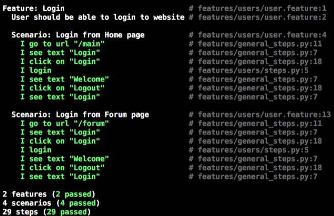

# How to test

## Install dependencies:

After pulling from origin, install Python dependencies through Pip:

```bash
[sudo] pip install -r requirements.txt
```

Install Firefox browser

## Run the tests:

In terminal:

```bash
cd tests
lettuce
```

You should see something like following: (green means test passed, red means failed)



## How to write new test:

The tests are written using [Lettuce](http://lettuce.it/) and [Splinter](splinter.readthedocs.org/en/latest/).

Test codes are located at: tests/features/. To write new test, you need to create:
- Feature file:
  - Contains some scenarios, describing what should happen
  - Usually written in English
  - Example: tests/features/forum/forum.feature
- steps file:
  - Contains definition for whatever written in feature file
  - Example: tests/features/forum/steps.py

Methods that can be shared between different tests should be placed in tests/features/general_steps.py.

Useful resources:
- [Splinter documentation](https://splinter.readthedocs.org/en/latest/#features) contains how to find elements on page, how to interact with elements & forms, how to verify presence of text...
